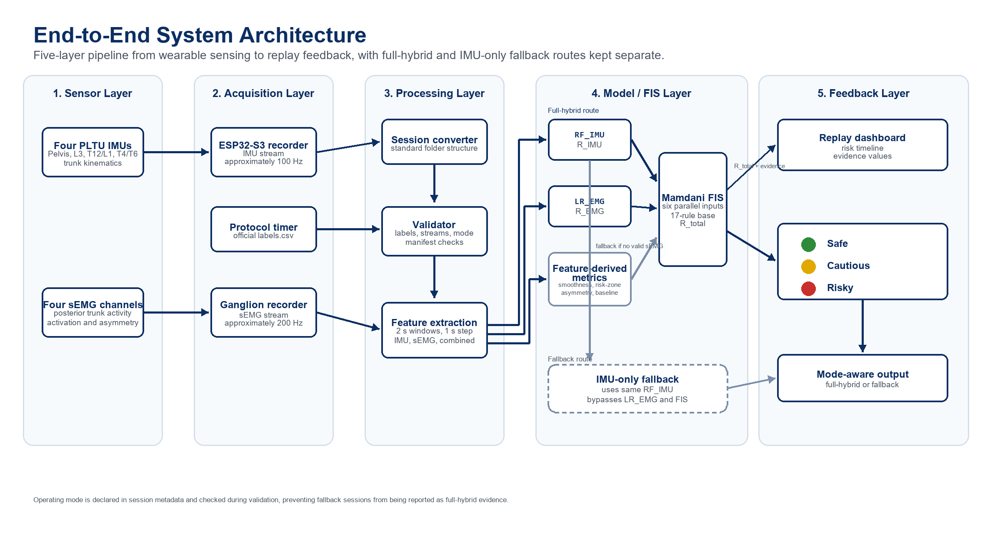

# What the system does



## The problem

Repeated risky trunk movements — deep forward flexion, fast uncontrolled bending, jerky lifting — are associated with lower-back loading. This project builds a **wearable that detects those movements in real time** and gives the wearer traffic-light feedback, so risk can be flagged as it happens rather than inferred after an injury.

"Risk" is defined deliberately and narrowly: **exceeding a biomechanical threshold (e.g. >45° lumbar flexion) or deviating from the wearer's own baseline.** It is not a clinical injury prediction.

## The sensing strategy

Two complementary signals:

- **IMUs give kinematics** — *what the spine is doing*: trunk angle, angular velocity, time in the risk zone, movement smoothness. This is the baseline system.
- **sEMG gives muscle activation** — *what the muscles are doing*: erector-spinae and oblique RMS, left–right asymmetry, fatigue. This is optional and has to earn its place quantitatively.

The IMUs follow the **PLTU placement model** — Pelvis (reference), L3, T12–L1, T4–T6 — which lets the system separate pelvic tilt from true lumbar flexion, spot compensation patterns, and detect shoulder-driven movement rather than treating the trunk as one rigid block.

## How a movement becomes a risk score

```
4× IMU (100 Hz) ──► Madgwick AHRS ──► inter-segment angles, velocity, smoothness ┐
                                                                                  ├─► 2 s windows ─► features ─► Random Forest ─► P(risk) ─► Fuzzy traffic light
(optional) sEMG (200 Hz) ──► filter ──► RMS / asymmetry / fatigue ────────────────┘
```

Each 2-second window yields a feature vector; a Random Forest outputs a risk probability; a Mamdani fuzzy layer maps that to a green/amber/red level with a short scientific and lay explanation.

## The two operating modes

- **Full hybrid** — IMU + sEMG together.
- **IMU-only fallback** — IMUs alone. **This is the mode the nine-participant cohort was recorded in**, after an EMG amplifier fault (see `../LIMITATIONS_AND_KNOWN_ISSUES.md`). The hybrid path is shown separately on participant P14.

## The headline finding

A **reduced two-IMU configuration (pelvis + L3) matches the full four-IMU configuration** — equal accuracy from half the sensors, and better within-participant. The discriminating signal is concentrated in the accelerometer-derived trunk-tilt at L3. Because it needs half the hardware for equal performance, the reduced set is the recommended design to build next. Numbers and figures: `../05_results/`.

## Engineering reality

The design respects the constraints it was built under: ESP32-S3 ADC and BLE bandwidth limits, ~200-250 kHz EMG vs ~50–200 Hz IMU sampling, IMU–EMG synchronisation, EMG motion artefact, and wearable issues (movement, electrode contact). Where something was attractive in theory but impractical on this hardware, it was cut. 
